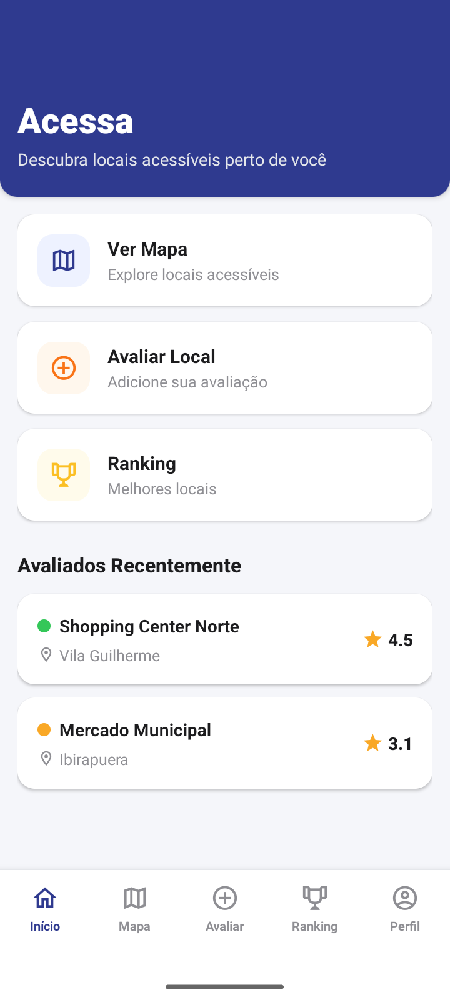
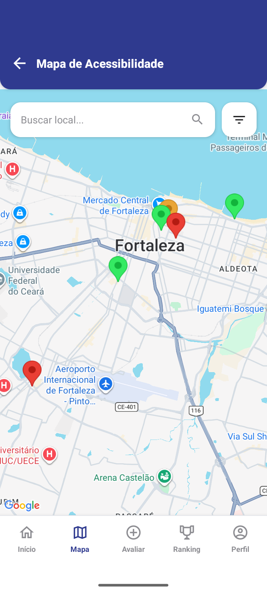
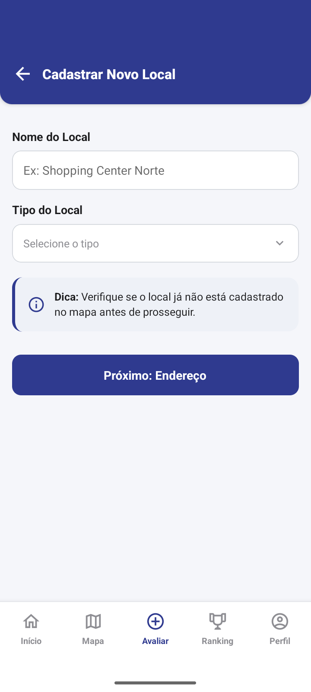
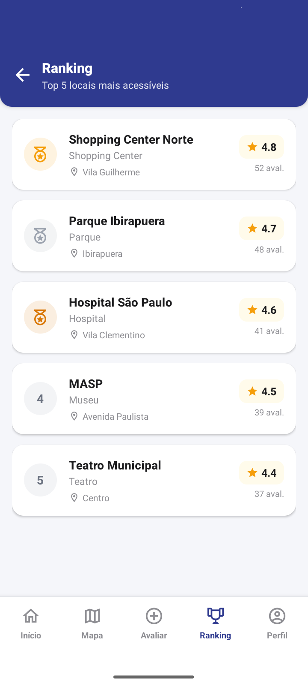

# ♿ Accessibility App

> Aplicativo mobile desenvolvido para auxiliar na identificação, avaliação e consulta de condições de acessibilidade em espaços urbanos.

Projeto desenvolvido em equipe como parte de uma atividade acadêmica do curso de Ciência da Computação.

---

## 📌 Sobre o Projeto

O **Accessibility App** foi desenvolvido com o objetivo de facilitar a identificação de condições de acessibilidade em diferentes espaços urbanos.

A aplicação permite que os usuários consultem locais cadastrados, visualizem informações sobre suas condições de acessibilidade, realizem avaliações e contribuam adicionando novos locais.

A proposta é oferecer uma maneira simples de encontrar e compartilhar informações que possam auxiliar pessoas na escolha de espaços mais acessíveis.

---

## 🚀 Funcionalidades

* **Autenticação:** Login e cadastro de usuários utilizando e-mail e senha.
* **Mapa:** Visualização dos locais cadastrados através de um mapa interativo.
* **Detalhes dos locais:** Consulta das informações e características de acessibilidade de cada local.
* **Filtros:** Filtragem dos locais de acordo com suas características e recursos de acessibilidade.
* **Avaliações:** Avaliação dos locais através de notas, recursos disponíveis e comentários.
* **Cadastro de locais:** Possibilidade de adicionar novos locais à aplicação.
* **Ranking:** Classificação dos locais de acordo com suas avaliações.
* **Perfil:** Área destinada às informações do usuário.
* **Configurações:** Gerenciamento de configurações da aplicação.

### 📝 Processo de Avaliação

O processo de avaliação foi dividido em etapas para facilitar o preenchimento pelo usuário.

Durante uma avaliação, o usuário pode:

1. Atribuir uma nota ao local.
2. Selecionar os recursos de acessibilidade disponíveis.
3. Adicionar comentários e observações.
4. Conferir as informações preenchidas.
5. Confirmar a avaliação.

---

## 📱 Screenshots

### 🏠 Home

Tela principal da aplicação, responsável por apresentar ao usuário as principais funcionalidades e informações disponíveis.

<p align="center">
  
</p>

---

### 🗺️ Mapa

Tela destinada à visualização dos locais cadastrados e à consulta de informações relacionadas à acessibilidade.

<p align="center">
  
</p>

---

### ⭐ Avaliação

Tela utilizada para realizar a avaliação de um local, permitindo informar a nota, os recursos de acessibilidade e outras observações.

<p align="center">
  
</p>

---

### 🏆 Ranking

Tela que apresenta a classificação dos locais de acordo com suas avaliações.

<p align="center">
  
</p>

---

## 🛠️ Tecnologias Utilizadas

* **JavaScript**
* **React**
* **React Native**
* **Expo**
* **React Native Maps**
* **React Native Paper**
* **Firebase Authentication**
* **Cloud Firestore**

> **Navegação:** A navegação entre as telas foi implementada através de um sistema próprio de navegação, sem a utilização do React Navigation.

---

## 🔥 Integração com Firebase

Na versão final do projeto, foram utilizados serviços do Firebase para autenticação e armazenamento dos dados da aplicação.

### Firebase Authentication

Utilizado para:

* Cadastro de usuários;
* Login;
* Autenticação por e-mail e senha.

### Cloud Firestore

Utilizado como banco de dados NoSQL para armazenamento das informações da aplicação, incluindo dados relacionados aos usuários, locais e avaliações.

---

## 📂 Estrutura do Projeto

```text
accessibility-app/
│
├── assets/
├── components/
├── data/
├── screens/
├── theme/
│
├── App.js
├── app.json
├── index.js
├── package.json
└── README.md
```

### Principais telas

* `HomeScreen`
* `MapScreen`
* `DetailsScreen`
* `EvaluateScreen`
* `CreatePlaceScreen`
* `AddressScreen`
* `ConfirmScreen`
* `RankingScreen`
* `ProfileScreen`
* `LoginScreen`

---

## 👨‍💻 Minha Contribuição

### Vinícius Sobreira Bevilaqua

Durante o desenvolvimento do projeto, minhas principais responsabilidades individuais foram:

* Desenvolvimento do fluxo e da tela de **Login**;
* Implementação do sistema de **Ranking**;
* Desenvolvimento da área de **Configurações**;
* Participação no desenvolvimento e integração geral da aplicação.

---

## 👥 Equipe

O **Accessibility App** foi desenvolvido por uma equipe de **5 estudantes de Ciência da Computação**, trabalhando de forma colaborativa no desenvolvimento da aplicação.

---

## 🔧 Como Executar

### Pré-requisitos

É necessário ter instalado:

* [Node.js](https://nodejs.org/)
* npm
* [Expo](https://expo.dev/)

### Instalação

Clone o repositório:

```bash
git clone https://github.com/viniciusbevilaqua/accessibility-app.git
```

Entre na pasta do projeto:

```bash
cd accessibility-app
```

Instale as dependências:

```bash
npm install
```

Inicie o projeto:

```bash
npx expo start
```

A aplicação pode ser executada através do **Expo Go**, utilizando o QR Code disponibilizado pelo Expo, ou através de um emulador compatível.

---

## ⚠️ Observação

Este repositório contém uma versão do projeto anterior à versão final apresentada pela equipe.

Após esta versão, algumas funcionalidades receberam aprimoramentos e a integração com **Firebase Authentication** e **Cloud Firestore** foi refinada na entrega final.

---

## 📄 Licença

Projeto desenvolvido para fins acadêmicos.
